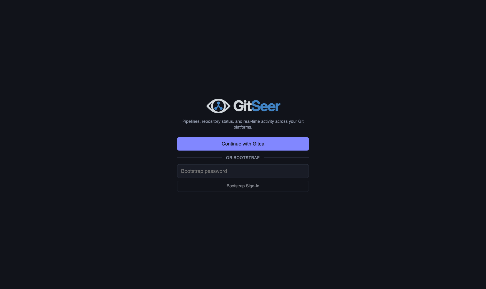
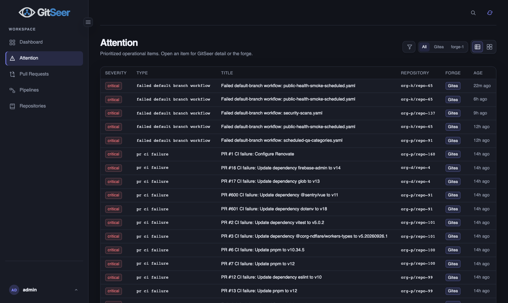
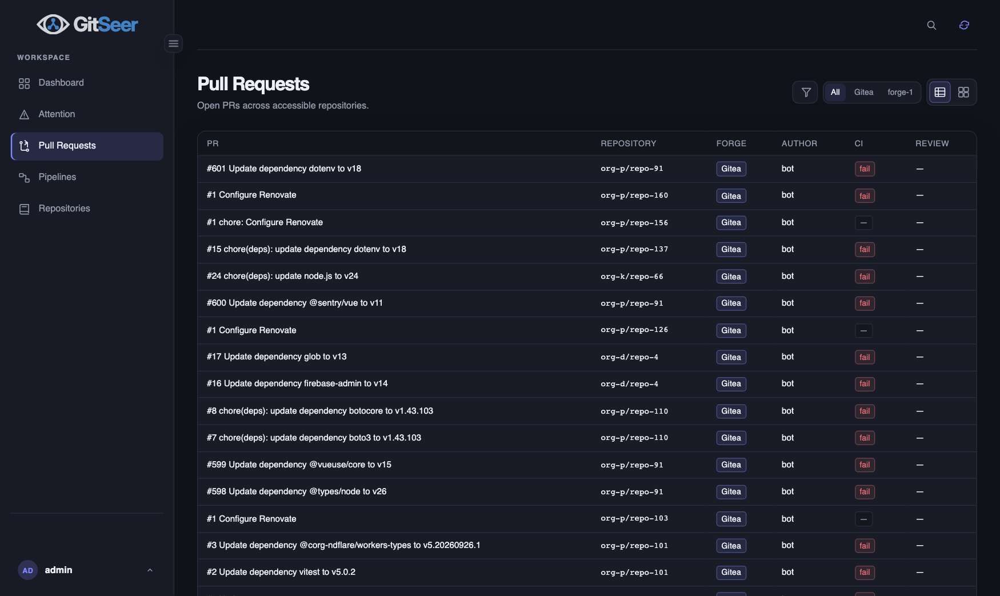
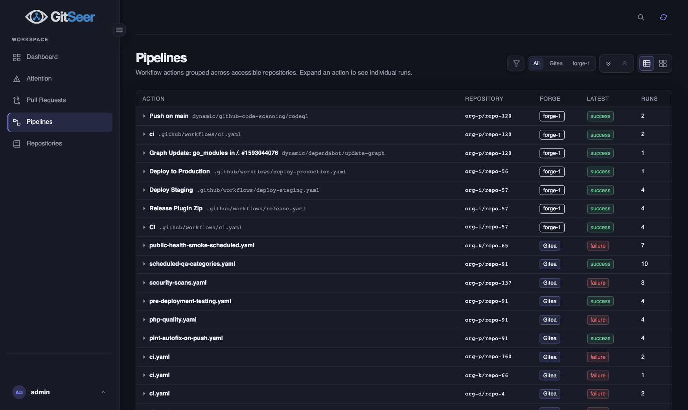
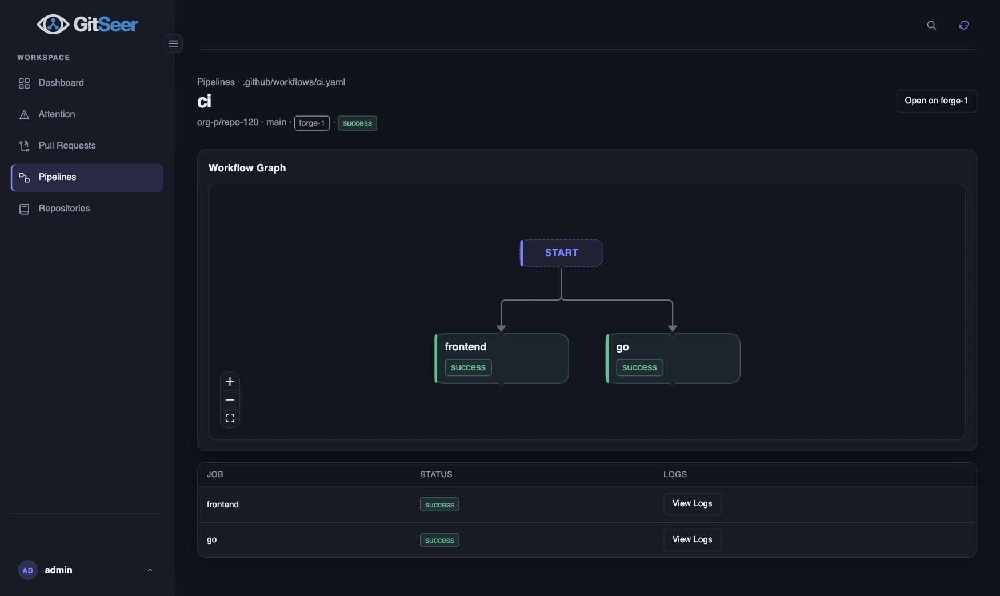
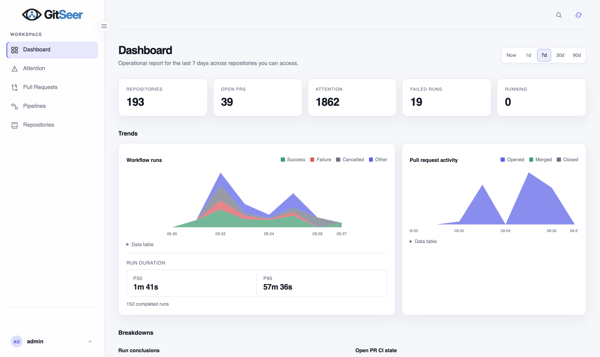
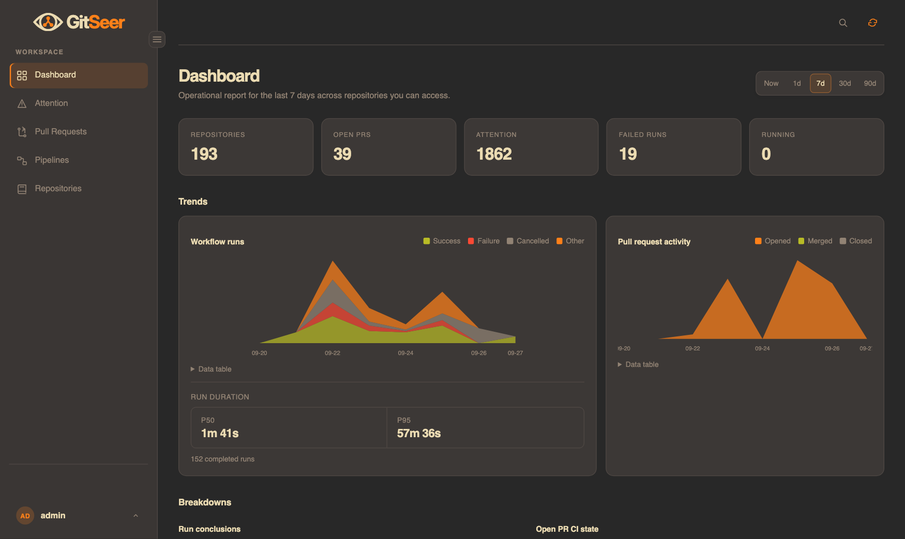
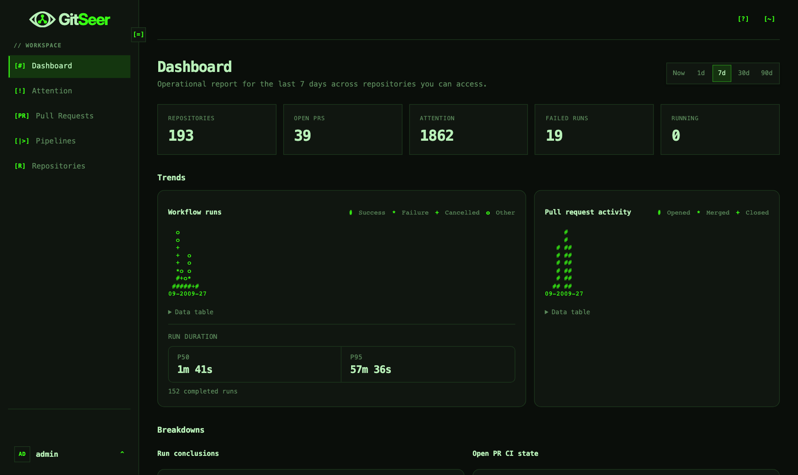
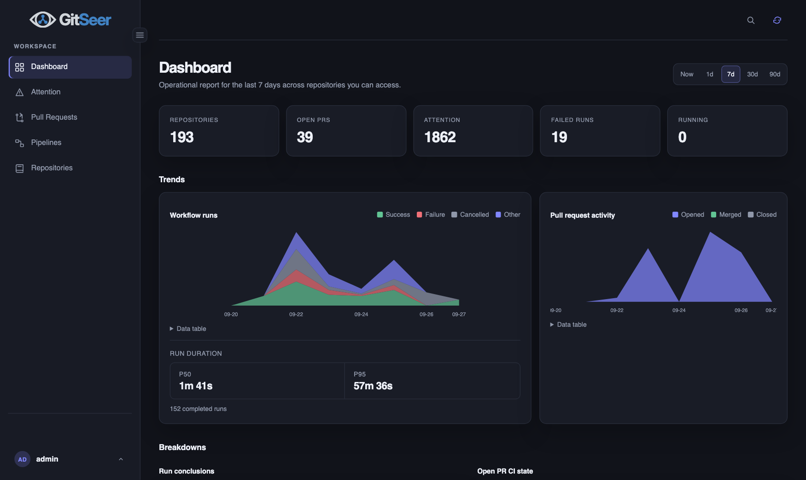

# GitSeer

Self-hosted CI/CD and pull-request ops console for Gitea, Forgejo, GitHub (github.com and Enterprise), GitLab, and Bitbucket Cloud.

Syncs repositories, open PRs, workflow runs, and attention items into one ACL-aware UI. Each forge stays the system of record; GitSeer talks to them over API and webhooks. Login is forge OAuth (PKCE) and/or bootstrap (claimed on first visit). Inventory sync uses a per-instance service token / PAT.

Technical IDs: Go module `github.com/ncdlabs/gitseer`, binary `gitseer`, Helm `gitseer`, env `GITSEER_*`. Maintained by [ncdLabs](https://ncdlabs.com).

**Quick start** (macOS / Linux):

```bash
curl -fsSL https://raw.githubusercontent.com/ncdlabs/gitseer/main/scripts/install-binary.sh | bash
```

Then open http://127.0.0.1:8090. Windows: grab the `.exe` from [Releases](https://github.com/ncdlabs/gitseer/releases). More options below.

**Docs:** [docs/](docs/README.md) · **Wiki:** [github.com/ncdlabs/gitseer/wiki](https://github.com/ncdlabs/gitseer/wiki) · **Compatibility:** [docs/compatibility.md](docs/compatibility.md)


---

## Who This Is For

- Operators who want one ops console across one or more self-hosted or cloud forges
- Teams that already run Gitea/Forgejo/GitHub/GitLab/Bitbucket and want attention, pipelines, and PRs in one place
- Homelab / small-org installs that prefer a single binary or Compose stack with SQLite

## Who This Is Not For

- A replacement for the forge itself (GitSeer does not host git or runners)
- Multi-replica SQLite deployments (use Postgres if you need more than one replica)
- Multi-arch **container** hosts that cannot run linux/amd64 (release images are amd64-only; native binaries cover darwin/windows/linux × amd64/arm64)

---

## Screenshots

**Login**



**Attention**



**Pull Requests**



**Pipelines**



**Pipeline Detail**



### Dashboard Themes

System follows the OS preference (shown here resolving to dark).

| Light | Dark |
|-------|------|
|  |  |

| Gruvbox | Terminal |
|---------|----------|
|  |  |

**System** (OS preference)



---

## Features

- **Dashboard** — time-scoped summary and trends (Now / 1 / 7 / 30 / 90 days); org/forge filters
- **Attention** — rules for CI failures, review waits, long-running runs, and merge conflicts
- **Inbox** — ACL-scoped items that need you (author, reviewer, failing CI, blocked on me)
- **Repositories, pull requests, pipelines** — ACL-scoped lists with SSE updates; on-demand job logs
- **Browser & OS alerts** — Notification API while a tab is open; self-hosted Web Push for closed tabs (Settings → Notifications)
- **Outbound notifications** — optional SMTP / Slack / Discord / HTTPS / incident webhooks (bootstrap admin)
- **Setup wizard** — Prepare → forge picker → Connect → Validate → Finish
- **Settings** — runtime preferences and multi-instance forge integration (DB secrets are write-only; instance CRUD is bootstrap-admin)
- **Gitea UI hooks** — optional `install-ui` links from Gitea nav / repo tabs
- **Ops** — Prometheus `/metrics`, retention purge, wallboard tokens; SQLite by default (Postgres for multi-replica)

Release binaries cover **linux / darwin / windows** × **amd64 / arm64**. Container images remain **linux/amd64**. Use Postgres if you need more than one replica.

---

## Prerequisites

| Component | Version / notes |
|-----------|-----------------|
| Container or binary | Native release binaries (linux/darwin/windows × amd64/arm64); container image **linux/amd64** |
| Go / Node (from source) | Go 1.26+ (`go.mod`), Node 22+ |
| Forge | At least one: Gitea ~1.25+, Forgejo, GitHub / GHE, GitLab, or Bitbucket Cloud |
| Compose (installer default) | Docker Compose (Podman Compose also works) |

---

## Quick start

Detail: [docs/getting-started.md](docs/getting-started.md) · [docs/install.md](docs/install.md).

### A. Public container

```bash
docker run --rm -p 8090:8090 \
  --platform linux/amd64 \
  -v gitseer-data:/data \
  -e GITSEER_SERVER_LISTEN=0.0.0.0:8090 \
  -e GITSEER_SERVER_EXTERNAL_URL=http://127.0.0.1:8090 \
  -e GITSEER_DATABASE_PATH=/data/gitseer.db \
  ghcr.io/ncdlabs/gitseer:1.0.8
```

Open **http://127.0.0.1:8090**, complete Setup (claim bootstrap password in the UI), sign in, then **Sync Now**.

Notes:

- Image is **linux/amd64**. `--platform linux/amd64` is required on Apple Silicon / arm64 hosts (and harmless on amd64).
- Prefer a **named volume** (`gitseer-data`) so the non-root container user (uid 10001) can write the SQLite DB. A host bind mount needs ownership/permissions for uid 10001.
- Pre-seed a forge before Setup (optional): `GITSEER_GITEA_URL` / `GITSEER_GITEA_TOKEN` / `GITSEER_WEBHOOK_SECRET` (or matching `GITSEER_GITHUB_*` / GitLab / Bitbucket vars)
- Bootstrap username hint: `GITSEER_AUTH_BOOTSTRAP_USERNAME` (default `admin`; claim the password in the UI)

### B. Release binary

```bash
curl -fsSL https://raw.githubusercontent.com/ncdlabs/gitseer/main/scripts/install-binary.sh | bash
```

That detects OS/arch, downloads `./gitseer`, and runs `serve`. Override version with `VER=1.0.8`, or pass `--no-start` to download only:

```bash
VER=1.0.8 curl -fsSL https://raw.githubusercontent.com/ncdlabs/gitseer/main/scripts/install-binary.sh | bash -s -- --no-start
```

Script ([`scripts/install-binary.sh`](scripts/install-binary.sh)):

```bash
#!/usr/bin/env bash
set -euo pipefail

VER="${VER:-1.0.8}"
START=1

while [[ $# -gt 0 ]]; do
  case "$1" in
    --no-start) START=0 ;;
    -h|--help)
      cat <<'EOF'
Download a GitSeer release binary for this OS/arch.

Usage:
  curl -fsSL https://raw.githubusercontent.com/ncdlabs/gitseer/main/scripts/install-binary.sh | bash
  curl -fsSL … | bash -s -- --no-start
  VER=1.0.8 curl -fsSL … | bash

Options:
  --no-start   Download and chmod only; do not run ./gitseer serve
  -h, --help   Show this help
EOF
      exit 0
      ;;
    *)
      printf '✗ unknown option: %s\n' "$1" >&2
      exit 1
      ;;
  esac
  shift
done

OS=$(uname -s | tr '[:upper:]' '[:lower:]')
ARCH=$(uname -m)
case "$ARCH" in
  x86_64|amd64) ARCH=amd64 ;;
  aarch64|arm64) ARCH=arm64 ;;
  *)
    printf '✗ unsupported arch: %s\n' "$ARCH" >&2
    exit 1
    ;;
esac

case "$OS" in
  linux|darwin) ;;
  *)
    printf '✗ unsupported OS: %s (download a Windows .exe from GitHub Releases)\n' "$OS" >&2
    exit 1
    ;;
esac

URL="https://github.com/ncdlabs/gitseer/releases/download/v${VER}/gitseer_${VER}_${OS}_${ARCH}"
printf '==> downloading %s\n' "$URL"
curl -fsSL -o gitseer "$URL"
chmod +x gitseer
printf '✓ installed ./gitseer (v%s %s/%s)\n' "$VER" "$OS" "$ARCH"

if [[ "$START" -eq 1 ]]; then
  exec ./gitseer serve --config config.yaml
fi
```

On Windows, download `gitseer_${VER}_windows_amd64.exe` (or `windows_arm64`) from the [Releases](https://github.com/ncdlabs/gitseer/releases) page instead.

### C. Guided installer (Gitea-oriented)

Requires a Gitea URL and API token. Add other forges in Setup / Settings afterward. For non-Gitea-first installs, use A, B, or Compose + `/setup`.

```bash
git clone https://github.com/ncdlabs/gitseer.git
cd gitseer
./scripts/install.sh
# or: make install
```

Non-interactive:

```bash
cp install.example.yaml install.yaml   # fill in secrets
./scripts/install.sh --config install.yaml --non-interactive
```

### D. Compose from source

```bash
export GITSEER_SERVER_EXTERNAL_URL='http://127.0.0.1:8090'
export GITSEER_AUTH_BOOTSTRAP_USERNAME='admin'
# Optional: GITSEER_AUTH_BOOTSTRAP_KEEP_AFTER_SETUP=true|false
# Do not set GITSEER_AUTH_BOOTSTRAP_PASSWORD for new installs — claim in the UI.
# Optional pre-seed (or connect in /setup):
# export GITSEER_GITEA_URL=… GITSEER_GITEA_TOKEN=… GITSEER_WEBHOOK_SECRET=…
# export GITSEER_GITHUB_URL=https://github.com GITSEER_GITHUB_TOKEN=… GITSEER_GITHUB_WEBHOOK_SECRET=…
docker compose -f compose.yaml up --build
```

### E. Install with Agent

Paste this prompt into your coding agent (Cursor, Codex, Claude Code, etc.). Fill in the bracketed values first, or leave them blank and let the agent ask.

```text
Install GitSeer (repo ncdlabs/gitseer) from https://github.com/ncdlabs/gitseer on this machine.

Goals:
1. Prefer a native GitHub Release binary (linux/darwin/windows × amd64/arm64) or the public image `ghcr.io/ncdlabs/gitseer:1.0.8` (linux/amd64 via Docker). Fall back to cloning and `./scripts/install.sh` / Compose / `make build-go` if building from source.
2. Collect or confirm: forge plan (Gitea, Forgejo, GitHub, GitLab, and/or Bitbucket), forge base URL + API token/PAT, GitSeer public URL (server.external_url), suggested bootstrap username + keep/remove-after-setup choice, and encryption key (env or /setup Prepare). OAuth client id/secret are optional — the Setup wizard can create or paste them later.
3. Guided installer currently requires Gitea URL/token; for non-Gitea-first installs use the public image/binary/Compose and complete /setup. Set the matching webhook secret whenever a forge URL is set in config. Use GITSEER_*_ALLOW_PRIVATE_NETWORK=true only for private/lab forge URLs.
4. Start GitSeer, open the printed URL (default http://127.0.0.1:8090), complete /setup if shown (Prepare → Choose Forge → Connect → Validate → Finish), sign in, and click Sync Now.
5. Report the App URL, how to stop/restart, bootstrap vs OAuth login, and any remaining manual steps (per-instance webhooks, OAuth redirect URI, optional `gitseer install-ui`).

Constraints:
- Do not commit secrets, `.env`, `config.yaml`, `install.yaml`, `compose.override.yaml`, `values-k3s-home.yaml`, or `values-secret.yaml` (use the `*.example*` copies).
- Prefer .yaml over .yml for new config files.
- Follow docs/install.md and README.md; do not invent Redis, WebSockets, or undocumented forge types.
- Ask before destructive changes or removing existing services.

My values (replace or leave blank to prompt me):
- Primary forge: [gitea | forgejo | github | gitlab | bitbucket]
- Forge URL: [https://git.example.com | https://github.com | …]
- Forge token/PAT: [paste or point to a secret]
- Additional forges: [none | list]
- GitSeer public URL: [http://127.0.0.1:8090]
- Bootstrap username: [admin | other; claim password in UI on first visit]
- Bootstrap keep after setup: [true | false]
- Encryption key: [generate in Prepare | paste ≥24 chars | env]
- Install method: [binary | ghcr | compose | guided-installer]
- Private/lab forge network: [yes | no]
```

### Local development

```bash
make deps
npm run start          # API :8090 + Vite :5173; prints URLs + claim-bootstrap hint
# npm run stop | npm run restart
make test
```

Prefer `config.yaml` over `config.example.yaml` (override with `GITSEER_CONFIG`). On first visit, **Claim Bootstrap** sets username + password. Install/local can suggest a username via `GITSEER_AUTH_BOOTSTRAP_USERNAME` (default `admin`).

### Optional: Gitea UI links

```bash
./bin/gitseer install-ui --custom-path /var/lib/gitea/custom --gitseer-url https://gitseer.example.com
# remove: ./bin/gitseer uninstall-ui --custom-path /var/lib/gitea/custom
```

---

## Configuration

Defaults live in `config.example.yaml`. Environment overrides use the `GITSEER_*` prefix — see [docs/configuration.md](docs/configuration.md).

- Set `server.external_url` to the public URL (including subpath). GitSeer strips only that configured prefix — not client `X-Forwarded-Prefix`.
- When a forge URL is set in config, the matching webhook secret is required unless unsigned webhooks are explicitly allowed (lab only).
- OAuth redirects are per forge under `{external_url}/api/v1/auth/...` (see [docs/authentication-and-acl.md](docs/authentication-and-acl.md)). Inventory sync still uses a service token / PAT.
- `GITSEER_ENCRYPTION_KEY` (env/config min **16**, prefer ≥24; wizard paste min **24**) encrypts forge secrets and OAuth tokens at rest. Required to save integration secrets to the DB; the setup wizard can generate a key file when unset.
- Runtime settings and multi-instance forge integration are also managed in `/settings` after bootstrap login.
- Browser / OS alerts (Settings → **Notifications**) need a secure context (**HTTPS** or localhost) for Web Push. VAPID keys auto-generate beside the database unless `GITSEER_VAPID_*` is set.

---

## Documentation

| Resource | Contents |
|----------|----------|
| [docs/](docs/README.md) | Architecture, features, API, auth, deploy, operations |
| [docs/install.md](docs/install.md) | Installer modes, proxy, webhooks, backup |
| [docs/compatibility.md](docs/compatibility.md) | Forge and runtime matrix |
| [docs/prd-spec.md](docs/prd-spec.md) | Product requirements |
| [docs/implementation-plan.md](docs/implementation-plan.md) | Implementation direction |
| [CONTRIBUTING.md](CONTRIBUTING.md) | Dev workflow |
| [Wiki](https://github.com/ncdlabs/gitseer/wiki) | Same guides |

---

## Releases

Tagged releases publish **linux / darwin / windows** × **amd64 / arm64** binaries on GitHub Releases and a **linux/amd64** container image to **GHCR**:

```bash
docker pull --platform linux/amd64 ghcr.io/ncdlabs/gitseer:1.0.8
# or :latest
```

On Apple Silicon / arm64 hosts, keep `--platform linux/amd64` (images are amd64-only).

Docker Hub (`docker.io/ncdlabs/gitseer`) publishes only when `DOCKERHUB_USERNAME` / `DOCKERHUB_TOKEN` repo secrets are set.

Maintainers cut a release via **Actions → Cut release** (on `main`). Details: [docs/upgrade.md](docs/upgrade.md#cutting-a-public-release).

---

## Contributing

1. Fork and branch.
2. `make deps && make test && npm run start`
3. Keep forge wire types under `internal/forge/…`; enforce authz server-side.
4. Open a PR with a short summary and test notes.

See [CONTRIBUTING.md](CONTRIBUTING.md) and [docs/development.md](docs/development.md).

---

## License

Apache-2.0 — see [LICENSE](LICENSE).

Gitea®, Forgejo®, GitHub®, GitLab®, and Bitbucket® are trademarks of their respective owners. This project is not affiliated with or endorsed by those projects.
